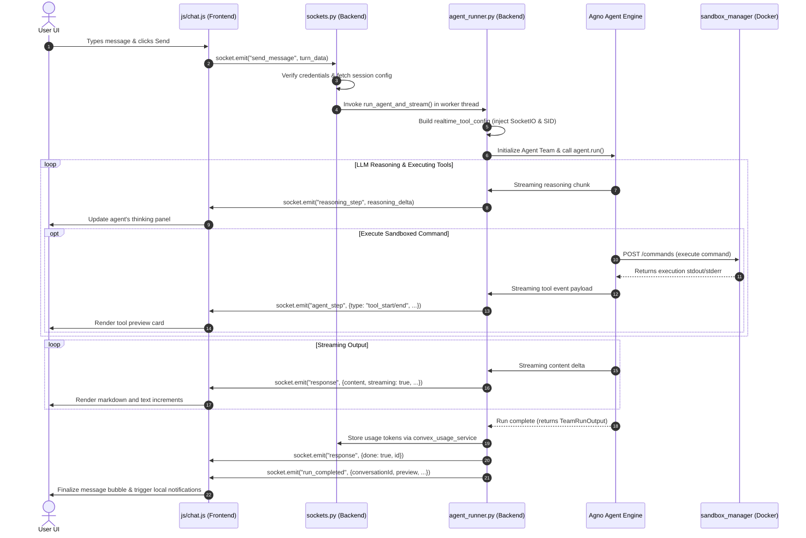

# System Architecture & Communication Patterns

This document explains the technical layers of AI-OS (Aetheria AI) and how data and messages move through the system in real time.

---

## 🏗️ Layered Architecture

AI-OS is designed as a decoupled, multi-process desktop operating system assistant. The code is divided into three distinct operational layers:

### 1. The Presentation Layer (Electron Frontend)
*   **Location:** `/` and `/js/`
*   **Engine:** Electron shell. The main process (`main.js`) manages native window frames, file loaders, and IPC communications, while the renderer process displays the UI (`index.html`, `chat.html`, `to-do-list.html`).
*   **State:** The frontend manages local rendering buffers, active chat selections, media attachments, and local visual preview files. It keeps persistent WebSockets open to the Python server.

### 2. The Intelligence Layer (Python Backend)
*   **Location:** `/python-backend/`
*   **Engine:** Flask, Gunicorn, Eventlet, Flask-SocketIO.
*   **Framework:** Agno AI multi-agent orchestration.
*   **State:** The backend is stateless by design. Active user settings, conversation threads, and LLM memories are stored in Supabase, while immediate connection records and execution states are held in Redis.

### 3. The Execution Layer (Sandbox Environment)
*   **Location:** `/sandbox_manager/` and local Docker daemon.
*   **Engine:** Docker container running custom Ubuntu images.
*   **State:** The Sandbox Manager processes start and stop requests for sandboxes, executes terminal commands, reads/writes file blocks, and streams artifacts out to Supabase storage.

---

## 🔄 Real-Time Communication Sequence

When a user submits a prompt, a sequence of events spans the entire stack. Below is the communication flow:

---

## 📡 WebSocket Event Registry

All real-time actions are coordinated via Socket.IO events. When modifying files like [sockets.py](file:///c:/Users/prajw/Downloads/app/AI-OS/python-backend/sockets.py) or [chat.js](file:///c:/Users/prajw/Downloads/app/AI-OS/js/chat.js), you must maintain the expected payloads for the following events:

### Client-to-Server Events (Emitted by Frontend)
*   **`connect` / `disconnect`**
    *   *Payload:* Optional auth tokens inside header handshakes.
    *   *Trigger:* Connection lifecycle states. Establishes the socket association to active user profiles.
*   **`join_conversation`**
    *   *Payload:* `{"conversationId": string}`
    *   *Trigger:* Joins the WebSocket room `conv:{conversationId}`. Ensures stream chunks are broadcast to all clients viewing the same chat thread.
*   **`send_message`**
    *   *Payload:* `{"conversationId": string, "messageId": string, "agentMode": string, "user_message": string, "files": Array}`
    *   *Trigger:* Starts the background agent runner pipeline.
*   **`browser_command_result` / `computer_command_result` / `local_coder_command_result`**
    *   *Payload:* Command output values, images, or files.
    *   *Trigger:* Relays raw desktop interaction results from the desktop client back to the backend.

### Server-to-Client Events (Emitted by Backend)
*   **`reasoning_step`**
    *   *Payload:* `{"id": string, "agent_name": string, "step": string}`
    *   *Effect:* Streams thinking processes before tool execution or content responses are generated.
*   **`agent_step`**
    *   *Payload:* `{"type": "tool_start" | "tool_end", "name": string, "id": string, "tool": object}`
    *   *Effect:* Tells the UI which tool is currently running and what the tool output is (used to render sheet tables, presentation template thumbnails, or git logs).
*   **`response`**
    *   *Payload:* `{"content": string, "streaming": boolean, "id": string, "is_log": boolean, "done": boolean}`
    *   *Effect:* Increments the text buffer for the chat message.
*   **`run_completed`**
    *   *Payload:* `{"conversationId": string, "messageId": string, "title": string, "preview": string}`
    *   *Effect:* Finalizes the chat status, updates background task trays, and triggers desktop notifications.

---

## 🗄️ Redis & Pub/Sub Operations

Redis serves a dual purpose in this architecture:
1.  **Socket.IO Message Queue:** Configured in `factory.py` via `socketio.init_app(app, message_queue=config.REDIS_URL)`. This enables Socket.IO events to be published across multiple web process workers.
2.  **Session & Run States:** Connection state metadata (e.g. active run tracker, active sandbox mappings) is stored directly in Redis keys with automatic Time-to-Live (TTL) expirations. This minimizes database queries during rapid stream iterations.
