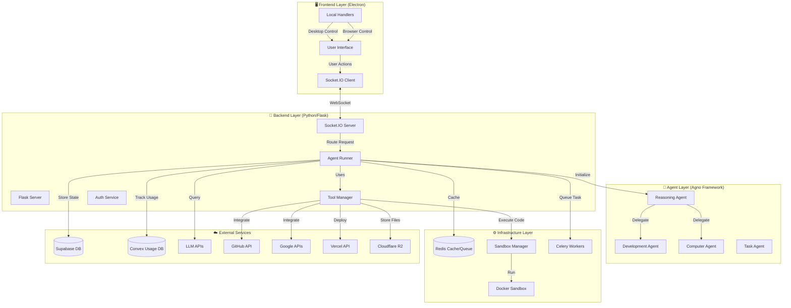

# Architecture & Design

## System Architecture Overview

Aetheria AI is built on a **decoupled, event-driven architecture** that separates the user interface from the intelligence layer. This design ensures the frontend remains responsive while the backend handles heavy computation and long-running tasks.

### High-Level Architecture Diagram



---

## Component Architecture

### 1. Frontend Layer (Electron)

The frontend is a desktop application built with Electron, providing a native experience across platforms.

#### Main Process (`js/main.js`)

**Responsibilities:**
- Application lifecycle management
- Window creation and management
- Deep link handling (`aios://` protocol)
- IPC communication with renderer
- Native OS integration

**Key Features:**
- Single instance lock for deep links
- Protocol registration for OAuth callbacks
- Native notification support
- Auto-update mechanism
- Tray icon management

#### Renderer Process

**Core Modules:**

1. **Chat Interface** (`js/chat.js`)
   - Message rendering and streaming
   - User input handling
   - File attachment management
   - Session state management

2. **Python Bridge** (`js/python-bridge.js`)
   - Socket.IO connection management
   - Event emission and handling
   - Reconnection logic
   - Error handling

3. **Project Workspace** (`js/project-workspace.js`)
   - File tree navigation
   - Code preview
   - Coder agent integration
   - Sandbox file management

4. **Computer Workspace** (`js/computer-workspace.js`)
   - Desktop control interface
   - Screenshot display
   - Permission management
   - Action history

5. **Browser Handler** (`js/browser-handler.js`)
   - Client-side browser automation
   - Playwright integration
   - Screenshot capture
   - Command execution

6. **Computer Control Handler** (`js/computer-control-handler.js`)
   - Desktop automation client
   - Mouse/keyboard simulation
   - Window management
   - File operations

7. **Local Coder Handler** (`js/local-coder-handler.js`)
   - Local project management
   - File system operations
   - Terminal integration
   - Git operations

#### UI Architecture

```
┌─────────────────────────────────────────────────────────┐
│                     Main Window                          │
│  ┌────────────┐  ┌──────────────────────────────────┐  │
│  │            │  │                                  │  │
│  │  Sidebar   │  │      Chat Area                   │  │
│  │            │  │                                  │  │
│  │  - New     │  │  ┌────────────────────────────┐ │  │
│  │  - History │  │  │  Message Stream            │ │  │
│  │  - Tasks   │  │  │                            │ │  │
│  │  - Settings│  │  └────────────────────────────┘ │  │
│  │            │  │                                  │  │
│  │            │  │  ┌────────────────────────────┐ │  │
│  │            │  │  │  Input Area                │ │  │
│  │            │  │  │  [Attachments] [Voice]     │ │  │
│  │            │  │  └────────────────────────────┘ │  │
│  └────────────┘  └──────────────────────────────────┘  │
│                                                         │
│  ┌─────────────────────────────────────────────────┐   │
│  │         Project Workspace (Sliding Panel)       │   │
│  │  ┌──────────────┐  ┌──────────────────────┐    │   │
│  │  │  File Tree   │  │  File Preview        │    │   │
│  │  └──────────────┘  └──────────────────────┘    │   │
│  └─────────────────────────────────────────────────┘   │
└─────────────────────────────────────────────────────────┘
```

---

### 2. Backend Layer (Python/Flask)

The backend orchestrates AI agents, manages state, and coordinates tool execution.

#### Application Factory (`python-backend/factory.py`)

Creates and configures the Flask application with all necessary extensions:

```python
def create_app():
    app = Flask(__name__)
    
    # Initialize extensions
    socketio.init_app(app)
    CORS(app)
    Compress(app)
    
    # Register blueprints
    app.register_blueprint(api_bp)
    app.register_blueprint(auth_bp)
    
    # Register socket handlers
    register_socket_handlers(socketio)
    
    return app
```

#### Socket.IO Server (`python-backend/sockets.py`)

Handles real-time communication with the frontend:

**Key Events:**

- `connect` - Client connection established
- `disconnect` - Client disconnection
- `send_message` - User message received
- `stop_agent` - Stop current agent execution
- `browser-response` - Browser command response
- `computer-response` - Computer control response
- `local-coder-response` - Local coder response

**Event Flow:**

```
Client                    Server                    Agent
  │                         │                         │
  ├─ send_message ─────────>│                         │
  │                         ├─ Validate & Route ─────>│
  │                         │                         │
  │<─ agent-thinking ───────┤<─ Stream Events ────────┤
  │<─ tool-execution ───────┤                         │
  │<─ agent-response ───────┤                         │
  │                         │                         │
```

#### Agent Runner (`python-backend/agent_runner.py`)

Orchestrates agent execution and manages the agent lifecycle:

**Responsibilities:**
- Agent initialization with user context
- Tool configuration and injection
- Event streaming to frontend
- Error handling and recovery
- Usage tracking and rate limiting
- Delegation management

**Agent Selection Logic:**

```python
def run_agent(user_id, message, session_id, agent_mode, ...):
    if agent_mode == 'coder':
        agent = get_coder_agent(...)
    elif agent_mode == 'computer':
        agent = get_computer_agent(...)
    else:
        agent = get_llm_os(...)  # Default reasoning agent
    
    # Execute agent with streaming
    for event in agent.run(message):
        emit_event_to_frontend(event)
```

#### REST API (`python-backend/api.py`)

Provides HTTP endpoints for non-real-time operations:

**Endpoint Categories:**

1. **Session Management**
   - `GET /api/sessions` - List user sessions
   - `GET /api/sessions/<id>` - Get session details
   - `DELETE /api/sessions/<id>` - Delete session

2. **File Operations**
   - `POST /api/project/workspace/tree` - List sandbox files
   - `POST /api/project/workspace/file-content` - Read sandbox file
   - `GET /api/deploy/files` - List deployed files
   - `GET /api/deploy/file-content` - Read deployed file

3. **Deployment Management**
   - `GET /api/deployments` - List user deployments
   - `GET /api/deployments/<id>` - Get deployment details

4. **Usage & Subscription**
   - `GET /api/usage/current` - Get current usage
   - `GET /api/subscription/status` - Get subscription status

---

### 3. Agent Layer (Agno Framework)

The intelligence layer uses the Agno framework for multi-agent orchestration.

#### Agent Hierarchy

```
Aetheria_AI (Team)
├── REASONING AGENT (Leader)
│   ├── Plans tasks
│   ├── Decomposes problems
│   └── Delegates to specialists
│
├── dev_team (Sub-team)
│   ├── Aetheria_Coder
│   │   ├── Sandbox execution
│   │   ├── GitHub operations
│   │   └── Deployment management
│   │
│   └── Aetheria_Deployer
│       ├── Vercel deployment
│       ├── Cloudflare Workers
│       └── Database provisioning
│
└── Computer_Agent (Optional)
    ├── Desktop control
    ├── Browser automation
    └── File operations
```

#### Agent Definitions

**1. Reasoning Agent** (`assistant.py`)

```python
Agent(
    name="REASONING AGENT",
    role="Strategic planner and task coordinator",
    model=OpenRouter(id="minimax/minimax-m2.5:free"),
    tools=[
        DuckDuckGoTools(),
        BrowserTools(),
        UserFileVaultTools(),
        AgentDelegationTools(),  # Can delegate to specialists
    ],
    instructions=[
        "Analyze user intent and decompose into subtasks",
        "Delegate specialized work to appropriate agents",
        "Synthesize results and provide coherent responses",
    ]
)
```

**2. Development Agent** (`coder_agent.py`)

```python
Agent(
    name="Aetheria_Coder",
    role="Software engineering specialist",
    model=OpenRouter(id="minimax/minimax-m2.5:free"),
    tools=[
        SandboxTools(),
        GitHubTools(),
        DeployedProjectTools(),
        UserFileVaultTools(),
    ],
    instructions=[
        "Follow inspect -> edit -> verify -> summarize workflow",
        "Prefer surgical edits over full rewrites",
        "Validate all changes before reporting completion",
    ]
)
```

**3. Computer Agent** (`computer_agent.py`)

```python
Agent(
    name="Aetheria_Computer",
    role="Desktop and browser automation specialist",
    model=OpenRouter(id="minimax/minimax-m2.5:free"),
    tools=[
        ComputerTools(),
        BrowserTools(),
        GoogleEmailTools(),
        GoogleDriveTools(),
    ],
    instructions=[
        "Always check permissions before first action",
        "Use observe -> act -> verify loop",
        "Confirm destructive operations with user",
    ]
)
```

#### Memory System

Aetheria AI uses a sophisticated memory architecture:

**1. Agentic Memory**
- Persistent across sessions
- Stored in PostgreSQL
- Automatically retrieved based on context
- User-specific and agent-specific

**2. Session Summaries**
- Automatic summarization of long conversations
- Reduces context window usage
- Maintains conversation continuity

**3. Run History**
- Last 40 runs included in context
- Provides continuity within session
- Enables reference to previous actions

---

### 4. Tool System

Tools are the "hands" of the agents, enabling real-world actions.

#### Tool Architecture

```python
class Toolkit:
    """Base class for all toolkits"""
    
    def __init__(self, name: str, tools: List[callable]):
        self.name = name
        self.tools = tools
    
    # Tool methods are automatically exposed to agents
    def tool_method(self, param: str) -> str:
        """Tool description for LLM"""
        # Implementation
        return result
```

#### Tool Categories

**1. Execution Tools**
- `SandboxTools` - Code execution in Docker
- `LocalCoderTools` - Local project operations

**2. Integration Tools**
- `GitHubTools` - GitHub API operations
- `GoogleEmailTools` - Gmail operations
- `GoogleDriveTools` - Drive operations
- `GoogleSheetsTools` - Sheets operations
- `VercelTools` - Vercel deployment
- `SupabaseTools` - Database management

**3. Automation Tools**
- `BrowserTools` - Client-side browser control
- `ServerBrowserTools` - Server-side browser control
- `ComputerTools` - Desktop automation

**4. Utility Tools**
- `DuckDuckGoTools` - Web search
- `ImageTools` - Image generation
- `UserFileVaultTools` - File storage
- `DeployedProjectTools` - Deployment management

#### Tool Execution Flow

```
Agent                    Tool                    External Service
  │                       │                            │
  ├─ Call tool ──────────>│                            │
  │                       ├─ Validate params           │
  │                       ├─ Execute action ──────────>│
  │                       │                            │
  │                       │<─ Response ────────────────┤
  │<─ Return result ──────┤                            │
  │                       │                            │
```

---

### 5. Infrastructure Layer

#### Docker Sandbox

**Container Specification:**

```dockerfile
FROM ubuntu:22.04

# Install system dependencies
RUN apt-get update && apt-get install -y \
    python3.11 \
    python3-pip \
    git \
    curl \
    build-essential

# Create non-root user
RUN useradd -m -s /bin/bash sandboxuser

# Set workspace
WORKDIR /home/sandboxuser/workspace

USER sandboxuser
```

**Sandbox Manager** (`sandbox_manager/main.py`)

FastAPI service that manages sandbox lifecycle:

- Container creation and reuse
- Command execution
- File operations
- Resource cleanup

**Persistence Service** (`python-backend/sandbox_persistence.py`)

Manages sandbox state across sessions:

- Saves execution history to PostgreSQL
- Uploads workspace snapshots to R2
- Restores workspace on session resume
- Tracks file changes

#### Redis

**Use Cases:**

1. **Pub/Sub** - Browser/computer command responses
2. **Caching** - Session data, user context
3. **Task Queue** - Celery job queue
4. **Rate Limiting** - Usage tracking

**Key Patterns:**

```python
# Pub/Sub for browser commands
redis_client.publish(f"browser-response:{request_id}", json.dumps(result))

# Caching session data
redis_client.setex(f"session:{session_id}", 3600, json.dumps(data))

# Task queue
celery_app.send_task('deepsearch.run', args=[query, session_id])
```

#### Celery

**Background Tasks:**

- Deep research (web scraping and analysis)
- Long-running computations
- Scheduled tasks
- Batch processing

**Configuration:**

```python
celery_app = Celery(
    'aios',
    broker='redis://localhost:6379/0',
    backend='redis://localhost:6379/0'
)
```

---

### 6. Data Layer

#### Supabase (PostgreSQL)

**Schema Overview:**

```sql
-- User profiles
profiles (id, email, full_name, avatar_url, ...)

-- Agent sessions
agno_sessions (id, user_id, session_id, created_at, ...)

-- Agent memories
agno_memories (id, user_id, memory, created_at, ...)

-- Chat attachments
attachment (id, user_id, file_path, mime_type, ...)

-- User integrations (OAuth tokens)
user_integrations (id, user_id, service, access_token, ...)

-- Deployments
deployments (id, user_id, site_id, url, ...)

-- Tasks
tasks (id, user_id, title, status, priority, ...)
```

**Row-Level Security:**

All tables have RLS policies ensuring users can only access their own data:

```sql
CREATE POLICY "Users can only access their own data"
ON profiles FOR ALL
USING (auth.uid() = id);
```

#### Convex (Usage Tracking)

**Schema:**

```typescript
usage_events: {
  user_id: string,
  event_key: string,
  input_tokens: number,
  output_tokens: number,
  total_tokens: number,
  created_at_ms: number,
}

usage_daily: {
  user_id: string,
  day_key: string,
  total_tokens: number,
}

usage_windows: {
  user_id: string,
  window_key: string,
  plan_type: string,
  total_tokens: number,
}
```

**Usage Flow:**

```
Agent Execution
      │
      ├─ Track tokens used
      │
      ├─ Send to Convex
      │
      ├─ Aggregate by day/window
      │
      └─ Check against limits
```

#### Cloudflare R2

**Storage Structure:**

```
media-uploads/
├── screenshots/
│   └── {user_id}/{session_id}/{timestamp}.png
├── attachments/
│   └── {user_id}/{file_id}/{filename}
└── deployments/
    └── {site_id}/{file_path}
```

---

## Communication Patterns

### 1. Real-time Communication (WebSocket)

**Pattern:** Bidirectional event streaming

```javascript
// Frontend
socket.emit('send_message', {
  message: 'Deploy my app',
  session_id: '123',
  agent_mode: 'coder'
});

socket.on('agent-thinking', (data) => {
  // Update UI with agent thoughts
});

socket.on('tool-execution', (data) => {
  // Show tool execution status
});

socket.on('agent-response', (data) => {
  // Display final response
});
```

**Benefits:**
- Real-time updates
- Streaming responses
- Low latency
- Persistent connection

### 2. Request-Response (HTTP)

**Pattern:** RESTful API calls

```javascript
// Frontend
const sessions = await fetch('/api/sessions', {
  headers: { 'Authorization': `Bearer ${token}` }
});
```

**Benefits:**
- Simple and stateless
- Cacheable
- Standard HTTP semantics

### 3. Pub/Sub (Redis)

**Pattern:** Asynchronous message passing

```python
# Backend - Browser tool
request_id = str(uuid.uuid4())
socketio.emit('browser-command', {
  'request_id': request_id,
  'action': 'navigate',
  'url': 'https://example.com'
})

# Wait for response on Redis channel
pubsub = redis_client.pubsub()
pubsub.subscribe(f"browser-response:{request_id}")
result = wait_for_message(pubsub, timeout=30)
```

**Benefits:**
- Decouples sender and receiver
- Works across multiple workers
- Scalable

### 4. Task Queue (Celery)

**Pattern:** Asynchronous job processing

```python
# Backend - Queue deep research task
task = celery_app.send_task(
    'deepsearch.run',
    args=[query, session_id],
    kwargs={'depth': 3}
)

# Frontend - Poll for results
const result = await pollTaskStatus(task.id);
```

**Benefits:**
- Handles long-running tasks
- Retry logic
- Priority queues
- Monitoring (Flower)

---

## Security Architecture

### Authentication Flow

```
User                    Frontend                Backend                Supabase
 │                         │                       │                       │
 ├─ Login ────────────────>│                       │                       │
 │                         ├─ Auth Request ───────────────────────────────>│
 │                         │                       │                       │
 │                         │<─ JWT Token ──────────────────────────────────┤
 │<─ Success ──────────────┤                       │                       │
 │                         │                       │                       │
 ├─ API Request ──────────>│                       │                       │
 │                         ├─ Request + Token ────>│                       │
 │                         │                       ├─ Verify Token ───────>│
 │                         │                       │<─ User Info ──────────┤
 │                         │                       ├─ Process Request      │
 │                         │<─ Response ───────────┤                       │
 │<─ Data ─────────────────┤                       │                       │
```

### Sandbox Isolation

```
Host OS
├── Docker Engine
    ├── Sandbox Container (Isolated)
    │   ├── Non-root user (sandboxuser)
    │   ├── Limited resources (CPU, Memory)
    │   ├── No network access to host
    │   └── Workspace: /home/sandboxuser/workspace
    │
    └── Sandbox Manager (API)
        ├── Validates all commands
        ├── Sanitizes file paths
        └── Enforces resource limits
```

### Permission System

**Desktop Control:**

```
User                    Frontend                Backend                Agent
 │                         │                       │                       │
 │                         │                       │<─ Request permission ─┤
 │                         │<─ Permission prompt ──┤                       │
 │<─ Show dialog ──────────┤                       │                       │
 │                         │                       │                       │
 ├─ Grant/Deny ──────────>│                       │                       │
 │                         ├─ Response ───────────>│                       │
 │                         │                       ├─ Grant/Deny ─────────>│
 │                         │                       │                       │
```

---

## Scalability Considerations

### Horizontal Scaling

**Backend:**
- Multiple Flask workers (Gunicorn)
- Redis for shared state
- Celery workers for background tasks

**Database:**
- Supabase managed PostgreSQL (auto-scaling)
- Read replicas for heavy read workloads

**Storage:**
- Cloudflare R2 (unlimited scalability)

### Performance Optimization

**Frontend:**
- Code splitting and lazy loading
- Virtual scrolling for long lists
- Debounced API calls
- Local caching

**Backend:**
- Connection pooling
- Redis caching
- Async I/O (Eventlet)
- Database query optimization

**Agent:**
- Streaming responses (reduce perceived latency)
- Parallel tool execution
- Context window management

---

## Monitoring & Observability

### Logging

**Levels:**
- `DEBUG` - Detailed diagnostic information
- `INFO` - General informational messages
- `WARNING` - Warning messages
- `ERROR` - Error messages
- `CRITICAL` - Critical errors

**Log Aggregation:**
- Structured JSON logging
- Centralized log collection
- Log rotation and retention

### Metrics

**Application Metrics:**
- Request rate and latency
- Error rate
- Active connections
- Agent execution time

**Infrastructure Metrics:**
- CPU and memory usage
- Disk I/O
- Network traffic
- Container health

### Monitoring Tools

- **Flower** - Celery task monitoring
- **Redis CLI** - Redis monitoring
- **Docker Stats** - Container metrics
- **Supabase Dashboard** - Database metrics

---

## Deployment Architecture

### Development

```
Developer Machine
├── Frontend (Electron)
│   └── npm start
├── Backend (Flask)
│   └── python app.py
└── Infrastructure (Docker Compose)
    ├── Redis
    ├── Sandbox Manager
    └── Celery Worker
```

### Production

```
Cloud Infrastructure
├── Backend (Render/AWS)
│   ├── Load Balancer
│   ├── Flask Workers (N instances)
│   ├── Celery Workers (N instances)
│   └── Flower (Monitoring)
│
├── Database (Supabase)
│   └── PostgreSQL (Managed)
│
├── Cache (Redis)
│   └── Redis (Managed)
│
├── Storage (Cloudflare R2)
│   └── S3-compatible storage
│
└── Desktop App (Electron)
    └── Distributed via GitHub Releases
```

---

## Design Patterns

### 1. Factory Pattern

Used for creating agents and tools with different configurations:

```python
def get_llm_os(user_id, session_info, **kwargs):
    """Factory for creating the main agent"""
    tools = []
    
    if kwargs.get('internet_search'):
        tools.append(DuckDuckGoTools())
    
    if kwargs.get('enable_github'):
        tools.append(GitHubTools(user_id))
    
    return Team(
        name="Aetheria_AI",
        agents=[reasoning_agent, dev_team],
        tools=tools
    )
```

### 2. Strategy Pattern

Different execution strategies for browser/computer tools:

```python
if device_type == 'desktop':
    # Client-side strategy
    tools.append(BrowserTools(**config))
else:
    # Server-side strategy
    tools.append(ServerBrowserTools(**config))
```

### 3. Observer Pattern

Event-driven architecture for real-time updates:

```python
# Agent emits events
for event in agent.run(message):
    socketio.emit('agent-event', event, room=session_id)

# Frontend observes events
socket.on('agent-event', (event) => {
    updateUI(event);
});
```

### 4. Singleton Pattern

Single instance of critical services:

```python
# Supabase client
supabase_client = create_client(url, key)

# Redis client
redis_client = Redis.from_url(redis_url)
```

### 5. Decorator Pattern

Tool wrapping for additional functionality:

```python
def with_usage_tracking(tool_func):
    def wrapper(*args, **kwargs):
        start_time = time.time()
        result = tool_func(*args, **kwargs)
        duration = time.time() - start_time
        track_usage(tool_func.__name__, duration)
        return result
    return wrapper
```

---

## Technology Decisions

### Why Electron?

- **Cross-platform** - Single codebase for Windows, macOS, Linux
- **Native integration** - Access to OS features (notifications, deep links)
- **Web technologies** - Leverage existing web development skills
- **Rich ecosystem** - Extensive npm package availability

### Why Flask?

- **Lightweight** - Minimal overhead, fast startup
- **Flexible** - Easy to extend and customize
- **Python ecosystem** - Access to AI/ML libraries
- **WebSocket support** - Flask-SocketIO for real-time communication

### Why Agno?

- **Agent-first** - Built specifically for agentic workflows
- **Multi-agent** - Native support for agent teams
- **Memory** - Built-in persistent memory
- **Tool integration** - Easy tool creation and management

### Why Docker?

- **Isolation** - Complete sandbox isolation
- **Reproducibility** - Consistent environment across machines
- **Security** - Process and filesystem isolation
- **Portability** - Works on any Docker-compatible host

### Why Supabase?

- **Managed PostgreSQL** - No database administration
- **Built-in auth** - Authentication out of the box
- **Real-time** - Real-time subscriptions
- **Row-level security** - Fine-grained access control

---

*Last Updated: April 18, 2026*
